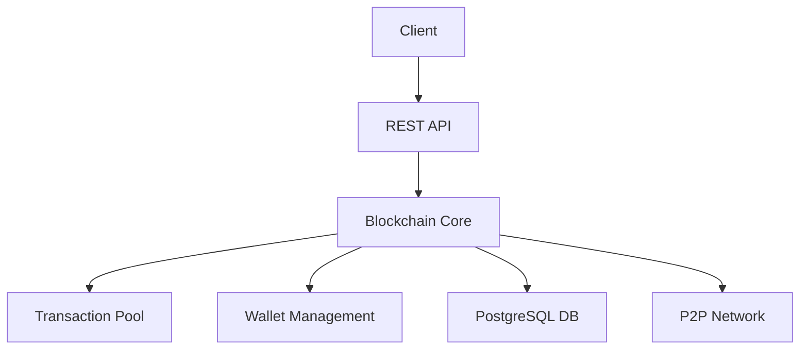
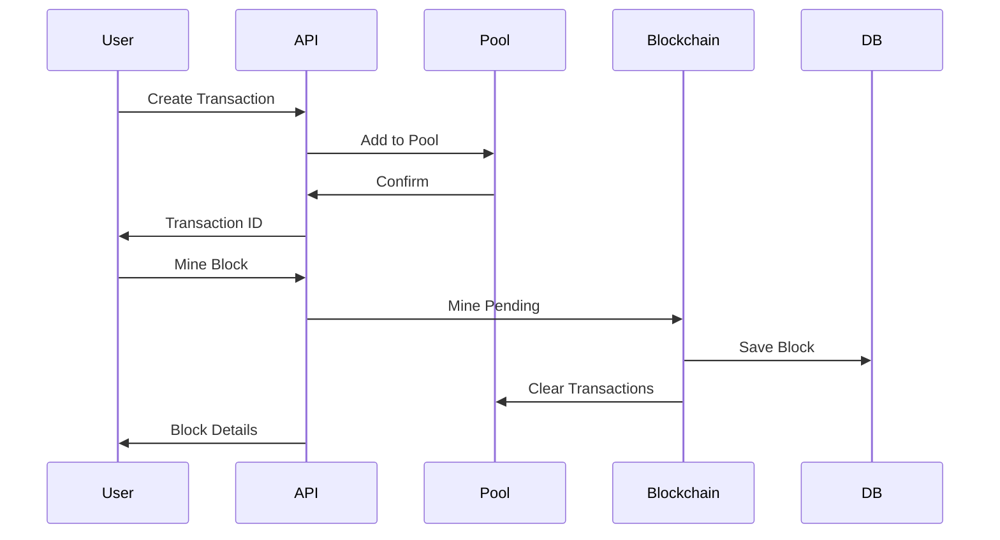

# Python Blockchain Implementation

A robust implementation of a blockchain system in Python with PostgreSQL persistence, cryptographic security, and a RESTful API.

## 📋 Table of Contents
- [Features](#features)
- [Project Structure](#project-structure)
- [Architecture](#architecture)
- [Setup](#setup)
- [Usage](#usage)
- [API Documentation](#api-documentation)
- [Development](#development)
- [Testing](#testing)
- [License](#license)

## ✨ Features

- 🔗 Blockchain core implementation with proof-of-work consensus
- 💰 Cryptocurrency transactions with RSA encryption
- 💼 Wallet management with public/private key pairs
- 📦 PostgreSQL database for persistent storage
- 🌐 RESTful API for blockchain interaction
- 🔒 Cryptographic security with RSA and SHA-256
- 🔄 Peer-to-peer network support
- 📊 Transaction pool management
- 🧪 Comprehensive test suite

## 📁 Project Structure

```
blockchain/
├── api/
│   ├── __init__.py
│   └── app.py              # Flask API implementation
├── core/
│   ├── __init__.py
│   ├── block.py           # Block implementation
│   ├── blockchain.py      # Blockchain implementation
│   ├── transaction.py     # Transaction implementation
│   └── transaction_pool.py # Transaction pool management
├── crypto/
│   ├── __init__.py
│   └── wallet.py          # Wallet and cryptographic operations
├── utils/
│   ├── __init__.py
│   ├── database.py        # PostgreSQL database operations
│   ├── initializer.py     # System initialization
│   └── storage.py         # Data persistence
├── config.py              # Configuration settings
└── __init__.py

tests/
├── __init__.py
├── test_api.py           # API tests
├── test_block.py         # Block tests
├── test_blockchain.py    # Blockchain tests
├── test_transaction.py   # Transaction tests
├── test_wallet.py        # Wallet tests
└── example_test.py       # Example usage tests

docs/
├── architecture.md       # Detailed architecture documentation
└── diagrams/            # Architecture and workflow diagrams
```

## 🏗 Architecture

### System Components



### Transaction Flow



## 🚀 Setup

1. Clone the repository:
   ```bash
   git clone https://github.com/yourusername/python-blockchain.git
   cd python-blockchain
   ```

2. Create and activate virtual environment:
   ```bash
   python -m venv venv
   source venv/bin/activate  # Linux/Mac
   # or
   .\venv\Scripts\activate  # Windows
   ```

3. Install dependencies:
   ```bash
   pip install -r requirements.txt
   ```

4. Set up PostgreSQL:
   ```bash
   # Create database
   createdb blockchain
   
   # Set environment variables
   cp .env.example .env
   # Edit .env with your database credentials
   ```

5. Initialize the system:
   ```bash
   python -m blockchain.api.app
   ```

## 📚 API Documentation

### Endpoints

| Endpoint | Method | Description |
|----------|--------|-------------|
| `/chain` | GET | Get the full blockchain |
| `/transactions/pending` | GET | Get pending transactions |
| `/transactions/new` | POST | Create a new transaction |
| `/mine` | GET | Mine a new block |
| `/nodes/register` | POST | Register a new node |
| `/nodes/resolve` | GET | Resolve blockchain conflicts |
| `/wallet/new` | GET | Create a new wallet |
| `/wallet/balance` | GET | Get wallet balance |

### Example Usage

```python
import requests

# Create a new wallet
response = requests.get('http://localhost:5000/wallet/new')
wallet = response.json()

# Create a transaction
transaction = {
    'sender': wallet['address'],
    'recipient': 'recipient_address',
    'amount': 10.0,
    'signature': '...'  # Sign with wallet's private key
}
response = requests.post('http://localhost:5000/transactions/new', json=transaction)

# Mine a new block
response = requests.get(f'http://localhost:5000/mine?address={wallet["address"]}')
```

## 💻 Development

1. Install development dependencies:
   ```bash
   pip install -r requirements-dev.txt
   ```

2. Run tests:
   ```bash
   pytest
   ```

3. Check code style:
   ```bash
   flake8
   black .
   ```

## 🧪 Testing

The project includes comprehensive tests:

- Unit tests for all core components
- Integration tests for API endpoints
- Example usage tests
- Performance benchmarks

Run tests with:
```bash
pytest
```

Generate coverage report:
```bash
pytest --cov=blockchain tests/
```

## 📄 License

This project is licensed under the MIT License - see the [LICENSE](LICENSE) file for details.

## 🤝 Contributing

1. Fork the repository
2. Create your feature branch (`git checkout -b feature/amazing-feature`)
3. Commit your changes (`git commit -m 'Add amazing feature'`)
4. Push to the branch (`git push origin feature/amazing-feature`)
5. Open a Pull Request

## 📞 Support

For support, please open an issue in the GitHub repository or contact the maintainers. 
